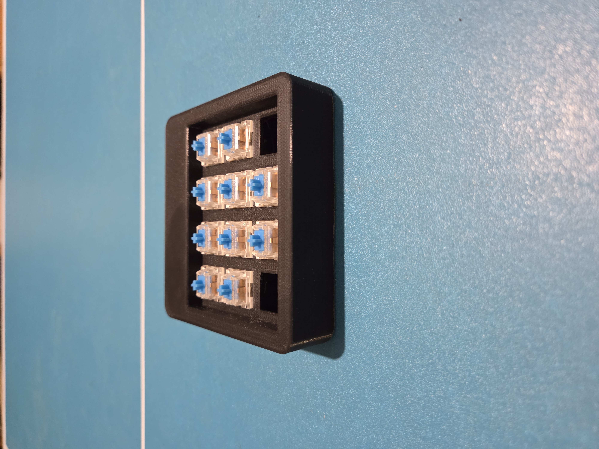
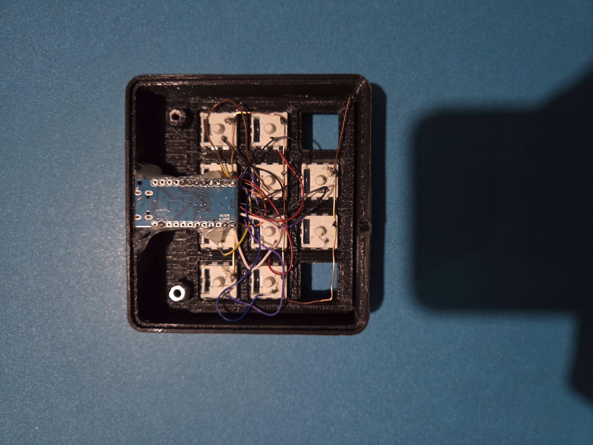
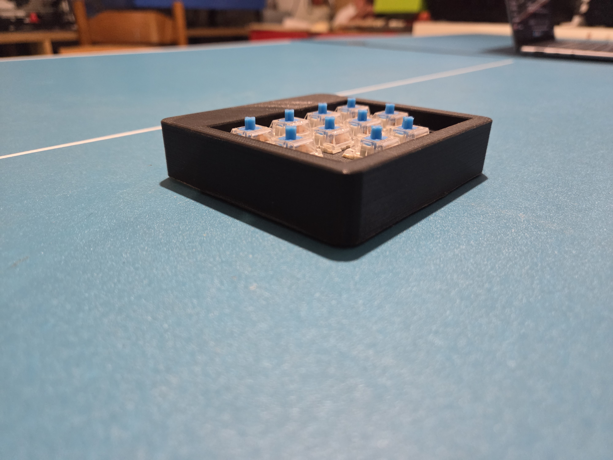
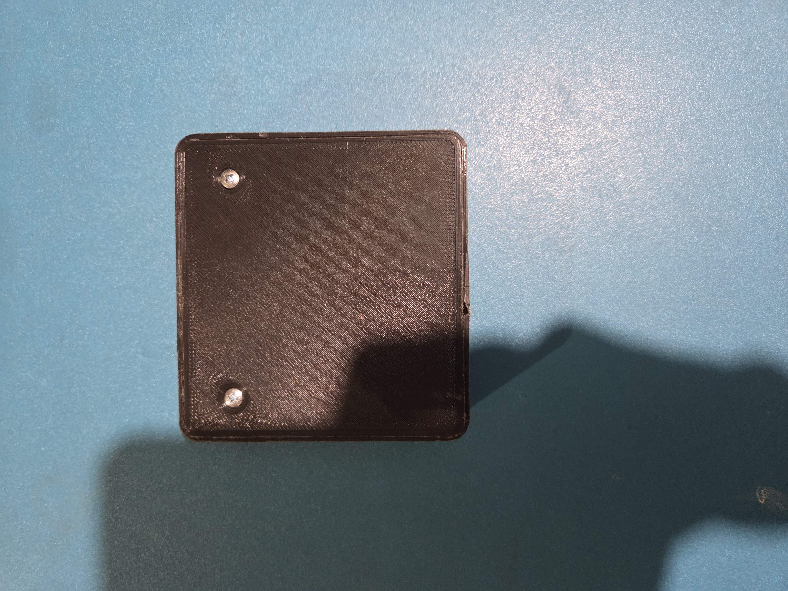
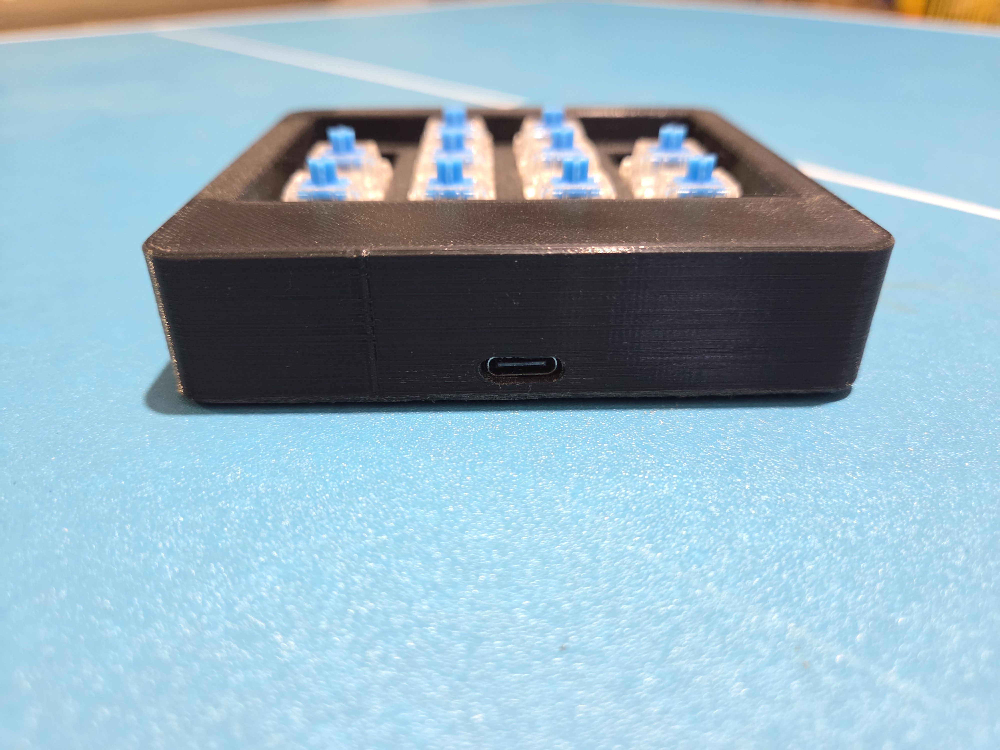

# ⌨️ 10-Key USB-C Macropad for Productivity

A small custom macropad built with **Arduino Pro Micro**, designed to speed up common workflows thanks to 10 dedicated macro keys. The entire assembly is enclosed in an **elegant 3D-printed case**, providing a compact and functional solution.

---

## 📸 Photo Gallery

Here is a gallery of images showing the finished product and construction stages (all files are located in the `images` folder):

---

## 🛠️ Hardware Used

This project was built as a simple wired prototype (point-to-point) using standard components and a direct soldering approach.

| Component | Quantity | Notes |
| :--- | :--- | :--- |
| **Microcontroller** | 1 | **Arduino Pro Micro (USB-C)** (or ATmega32U4 compatible) |
| **Switches** | 10 | **Blue** Mechanical Switches (clicky) |
| **Connections** | Various | Jumper Wires / Wires for wiring (soldered) |
| **Accessories** | 1 | Soldering iron, solder, and a **3D-printed case** |

---

## 🔌 Wiring Diagram

The project leverages the **INPUT_PULLUP** mode of Arduino, simplifying the wiring:

1.  **GND (Ground):** One side of all 10 switches is connected together and wired to the **GND** pin of the Arduino Pro Micro.
2.  **Data Pins:** The other side of each switch is individually connected to the specific digital pins of the Arduino.

| Switch No. | Arduino Pin | Function |
| :--- | :--- | :--- |
| **Key 1** | `D2` | **Copy** (`CTRL+C`) |
| **Key 2** | `D3` | **Paste** (`CTRL+V`) |
| **Key 3** | `D4` | **Cut** (`CTRL+X`) |
| **Key 4** | `D5` | **Save** (`CTRL+S`) |
| **Key 5** | `D6` | **Undo** (`CTRL+Z`) |
| **Key 6** | `D7` | **New File** (`CTRL+N`) |
| **Key 7** | `D8` | **Open File** (`CTRL+O`) |
| **Key 8** | `D9` | **Select All** (`CTRL+A`) |
| **Key 9** | `D16` | **Find** (`CTRL+F`) |
| **Key 10** | `D10` | **Screenshot** (`Win+Shift+S`) |

---

## ⚙️ Sketch Functionality (macropad.ino)

The sketch transforms the Arduino Pro Micro into an advanced **HID Keyboard (Human Interface Device)** thanks to the **`HID-Project`** library.

### Dependencies

The **`HID-Project`** library must be installed (via the Arduino IDE Library Manager) for advanced key combination management.

### Macro Details

The implemented macros are as follows (designed to speed up standard operations on Windows/Linux):

| Key | Function | Key Sequence Sent | Purpose |
| :--- | :--- | :--- | :--- |
| **1** | Copy | `CTRL` + `C` | Copies the selected text. |
| **2** | Paste | `CTRL` + `V` | Pastes the clipboard content. |
| **3** | Cut | `CTRL` + `X` | Cuts the selected text. |
| **4** | Save | `CTRL` + `S` | Quickly saves the current file. |
| **5** | Undo | `CTRL` + `Z` | Undoes the last action. |
| **6** | New File | `CTRL` + `N` | Opens a new document or window. |
| **7** | Open File | `CTRL` + `O` | Opens the file dialog window. |
| **8** | Select All | `CTRL` + `A` | Selects all content. |
| **9** | Find | `CTRL` + `F` | Opens the search/find bar. |
| **10** | Screenshot | `GUI (Win)` + `SHIFT` + `S` | Starts the Windows screen capture tool. |

---

## 🚀 Usage Instructions

1.  **Installation:** Ensure the Arduino IDE has the correct board selected (**Arduino Micro**).
2.  **Library:** Install the **`HID-Project`** library.
3.  **Upload:** Upload the sketch to your Arduino Pro Micro.
4.  **Operation:** Connect the Macropad to your PC via USB-C. It will be immediately recognized as a keyboard. Simply press one of the 10 keys to execute the respective macro.